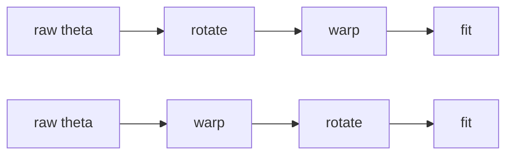

# Better coordinates

The other three levers choose which terms to keep while the axes stay fixed.
This one changes the axes. There are two transforms, they do not commute, and
`PreconditionedEmu` fits both orders and keeps the better one.

## A warp moves the convergence rate

Polynomial approximation on $[-1, 1]$ converges as $\rho^{-d}$, where $\rho$ is
the Bernstein parameter of the largest ellipse in which the target is analytic.
It is set by the nearest singularity in the **complex** plane, not by how
sharply the target bends on the real line.

For $f(x) = \tanh\bigl(20(x - 0.3)\bigr)$ the nearest poles sit at $0.3 \pm
i\pi/40$, giving $\rho = 1.0857$ and a predicted rate of $1/\rho = 0.9211$ per
degree. Fitting it directly gives a measured 0.921.

A monotone warp is a conformal map. It moves the singularity, and with it the
rate, which is why the curves below have different **slopes** rather than
different offsets.


| coordinate | rate per degree | degree for max error $10^{-3}$ |
|---|---|---|
| identity | 0.921 | 86 |
| `sinh(10, centre 0.5)`, the best the scan offers | 0.881 | 58 |
| `sinh(8, centre 0.3)`, placed by hand | 0.789 | 30 |

Because the term count grows as $d^{\,n}$, a halved degree divides the basis by
$2^{\,n}$. That is why the warp multiplies with the other three levers instead
of overlapping with them.

!!! note "The centre grid limits what the scan can reach"

    `fit_warps` scans a small family per axis: `log`, `sinh` at sharpness
    1, 3, 10, 30 and `kte` at 0.5, 0.9, 0.99, with the sinh centre taken from
    $\{-0.5,\,0,\,0.5\}$ only. The feature above sits at 0.3, which is not on
    that grid, so the third row is reachable by hand and not by the scan. On a
    target whose sharp feature is away from those three centres, expect the
    middle row rather than the bottom one.

`fit_warps` accepts a candidate only if it cuts the held-out error to 0.95 of
what the identity gives, because an axis that acts only through an interaction
has no marginal signal and would otherwise be handed a warp fitted to noise.
Axes are scored jointly by default; the cheaper marginal criterion missed the
transformation entirely on one test target.

```python
from MomentEmu.warp import WarpedEmu

emu = WarpedEmu(X, Y, max_degree_forward=12)
emu.report()["warps"]        # one spec per axis, e.g. ('log', 'identity', ...)
emu.report()["gain"]         # held-out error without warping / with it
```

`gain` below 1 means the warp made things worse on a degree-matched check, and
the constructor warns when that happens rather than keeping it silently.

## A rotation cuts the dimension

A ridge target $f(\theta) = h(W\theta)$ is low dimensional in the right
coordinates while carrying interactions at every order in the original ones, so
no index-set truncation helps: the monomial index set is not closed under
rotation.

The directions that matter are the leading eigenvectors of the gradient
covariance

$$
C = \mathbb{E}\bigl[J^{\mathsf T} J\bigr],
\qquad J_{ji} = \frac{\partial y_j}{\partial \theta_i} ,
$$

taken in standardised coordinates so that $C$ measures relative sensitivity and
the result does not depend on the units of either $\theta$ or $y$. Fitting a
degree-$d$ polynomial in $r$ rotated coordinates costs $C(d+r, r)$ instead of
$C(d+n, n)$.

### Where the derivatives come from

By default $J$ is read from a cheap pilot polynomial, which makes the rotation
inherit the pilot's error. If your model is differentiable, hand over the real
thing:

```python
from MomentEmu.rotation import ActiveSubspaceEmu

emu = ActiveSubspaceEmu(X, Y, rank=2, jacobian=model_jacobian)
```


Seven parameters, of which the target uses two, so five directions are exactly
dead. The degree-3 pilot leaks $\sim 10^{-4}$ of the spectrum into each of
them; the exact Jacobian leaves them at $10^{-16}$ and below. The leak does not
go away by raising the pilot degree, it only gets more expensive, and a higher
pilot degree wiggles in directions the target does not use.

`jacobian` takes a callable evaluated batch by batch on **raw** X, a
precomputed `(N, m, n)` array, or `(N, n)` for a single output.
`gradient_covariance` takes a ready $(n, n)$ matrix. The standardisation chain
rule is applied inside, so the derivatives stay in your own physical units.

### Output scaling

`output_scaling` decides how outputs are put on a common footing, and the
default is not the obvious one. `"per_output"` divides each output column by its
own standard deviation, which is right for genuinely different physical
quantities and wrong for the case this package targets, one quantity sampled at
many points: it makes a near-silent channel as important as the loudest. The
default `"global"` centres each output and divides everything by one scalar.

On a synthetic case with three loud channels carrying one direction and
thirty-seven channels carrying another ten thousand times weaker, per-output
scaling returned the *weak* direction as the leading one.

### Choosing the rank

`rank="auto"` takes the first rank reaching `variance_target` and stops. That
overshoots whenever the spectrum has a shallow tail, because a direction costs a
whole dimension of the $C(d+r, r)$ growth however little variance it carries. On
a travelling-trough target with shares 0.952, 0.030, 0.0099, 0.0033, 0.0026,
0.0012, 0.0008, the 0.999 target returned rank 6, while rank 2 at a higher
degree was 38 times smaller and more accurate.

Use `scan_rank` instead, which fits the pairs and reports accuracy against
budget:

```python
from MomentEmu.rotation import scan_rank

scan_rank(X, Y, ranks=[1, 2, 3, 4], degree=10, X_test=Xt, Y_test=Yt)
```

The gradient covariance does not depend on the rank, so the scan builds it once
for the whole sweep rather than once per rank.

## Composing the two



Neither order dominates, because each fails where the other works.

- A sharp feature along a **rotated** direction is invisible to a per-axis warp,
  since no single raw axis carries it. Measured at seven parameters on such a
  target: warping alone changed nothing at all, every axis came back identity;
  rotation alone reached 17.17 percent; rotating then warping reached 3.71
  percent with the same 91 coefficients.
- A ridge in **warped** coordinates is not a ridge in the raw ones. The active
  subspace is a linear projection, so rank reduction applied first discards real
  signal. On $\tanh(\sum_i a_i \log x_i)$, rotation alone scored 36.89 percent
  against 33.16 for no preconditioning at all, while warping first and then
  rotating reached 7.06 percent at 19 times fewer coefficients. The warp had
  concentrated the leading share of the spectrum from 0.832 to 0.961, which is
  what made the projection safe.

So `PreconditionedEmu(order="auto")` fits every candidate and keeps one, scoring
each with the estimator that will actually be used, and each at the highest
degree it can afford rather than at one degree shared by all.

```python
from MomentEmu.precondition import PreconditionedEmu

emu = PreconditionedEmu(X, Y, order="auto", select="parsimony")
emu.report()["order"]        # 'warp_rotate', say
emu.report()["scores"]       # held-out error per candidate order
```

`select="parsimony"` takes the smallest model within `parsimony_tol` of the best
error rather than the best error outright, which is usually what matters: on a
log-ridge target, warping alone scored 0.0352 against 0.0534 for warping then
rotating, but the latter used 105 coefficients against 1,716.

## A supplied Jacobian across a warp

Under `warp_rotate` the rotation is computed in the warped coordinates, so
$\partial y/\partial x_{\text{raw}}$ is not the Jacobian of what is being
rotated. It has to be divided by the warp's own derivative first, and the
package does that for you: a callable is always evaluated on raw X whichever
order is being scored.

The reason to state this rather than leave it implicit is that omitting the
division fails silently. On $\tanh(a^{\mathsf T}\log x)$ over three decades,
which is exactly rank one once the axes are logged:

| | leading direction | leading variance share |
|---|---|---|
| analytic truth | `[0.227, -0.098, 0.969]` | 1 |
| with the chain rule | `[0.227, -0.098, 0.969]` | $1 - 3\times10^{-16}$ |
| without it | `[0.99998, -0.003, 0.006]` | 0.9992 |

The wrong rotation is still orthonormal and still has a healthy-looking
spectrum. Nothing in the report says the direction is wrong.

A `gradient_covariance` cannot make that crossing. It is an average of
$J^{\mathsf T}J$ over the design, and moving it into warped coordinates needs
the per-sample $J$ the average has already summed away, so `order="warp_rotate"`
raises when named and is dropped from the candidates under `order="auto"`.
