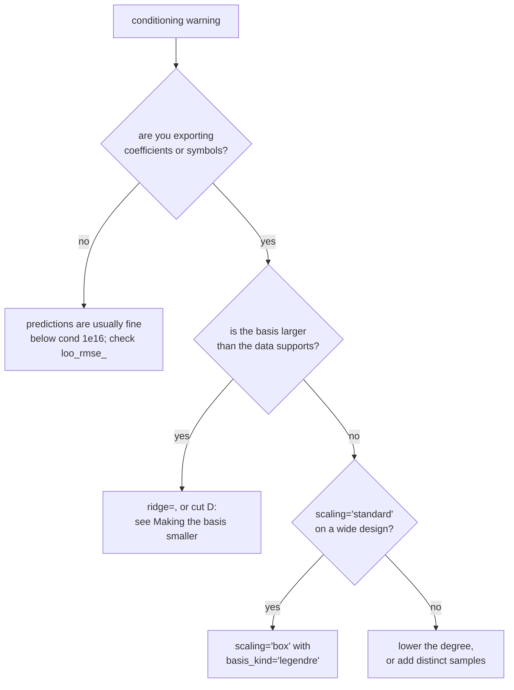

# Accuracy and conditioning

## The number being watched

The moment matrix is $M = \Phi^{\mathsf T}\Phi / N$, so

$$
\operatorname{cond}(M) = \operatorname{cond}(\Phi)^2 ,
$$

and a solve through $M$ loses twice the digits a solve through $\Phi$ would.
float64 carries $-\log_{10}\varepsilon = 15.65$ decimal digits, so a solve at
$\operatorname{cond}(M)$ keeps roughly

$$
15.65 - \log_{10}\operatorname{cond}(M)
$$

of them in the coefficients. That subtraction is what every warning in this
package quotes.

## The thresholds

| constant | value | effect |
|---|---|---|
| `COND_WARN` | $10^{12}$ | warn: the coefficients are no longer trustworthy to full precision |
| `COND_QR` | $10^{13}$ | switch the solve from Cholesky of $M$ to QR of $\Phi$ |
| `COND_RAISE` | $10^{16}$ | raise: $M$ is numerically singular |
| `COND_PHI_WARN` | $10^{12}$ | warn on $\operatorname{cond}(\Phi)$ after a QR solve |

They are separate numbers because they answer separate questions. Each was
calibrated, and the calibration is the reason to trust or distrust it.

**$10^{12}$ is about exported coefficients, not predictions.** Over five
$(n, \text{distribution})$ families at $N = 20{,}000$, the coefficient relative
error first exceeds $10^{-6}$ somewhere between $\operatorname{cond} = 8.1
\times 10^{12}$ and $4.4 \times 10^{16}$, while fresh-point prediction error
stays at or below $10^{-8}$ everywhere below $10^{16}$. So a `COND_WARN` warning
means the symbolic export and the read-off coefficients are unreliable at that
many digits; it does not mean the predictions are wrong.

**$10^{13}$ is where the normal equations stop paying.** Measured through the
fit path on a 4-parameter target, moving to the QR route took the stored
coefficients from $4.9\times10^{-11}$ to $2.6\times10^{-14}$ at degree 14 and
from $6.3\times10^{-10}$ to $1.4\times10^{-14}$ at degree 16, both below the old
trigger. It costs 1.76x on a rung that triggers and nothing on one that does
not. A target limited by truncation rather than conditioning is unaffected.

**$10^{16}$ is past $1/\varepsilon = 4.5\times10^{15}$.** There the eigenvalues
of the computed $M$ turn negative and the condition number is no longer
resolvable in float64. At the first degree past it, prediction error was worse
than at the previous degree in 5 of 5 families, while design-deficient cases at
$3.7\times10^{17}$ and $1.0\times10^{19}$ overshot fresh points by 11,986x and
1,607x. $\operatorname{cond}(M)$ cannot tell those two cases apart, which is why
the threshold raises rather than warns.

## Why cond(M) stops being informative

Above $\operatorname{cond}(M) \sim 10^{16}$ the smallest eigenvalue of the
*computed* $M$ is round-off, so the estimate saturates near $1/\varepsilon$ and
stops tracking $\Phi$. On a 1-D monomial design at $N = 200$ it reported
$5.9\times10^{8}$ at both $\operatorname{cond}(\Phi) = 1.1\times10^{11}$ and
$1.3\times10^{14}$: the same number for conditioning three decades apart.

`core.triangular_cond` therefore runs LAPACK's triangular condition estimator on
the $R$ the QR route already computed. It tracked the true 2-norm condition
number to within a factor 1.92 to 2.21 over eight decades, in an $O(D^2)$ call
against the QR's $O(ND^2)$. Above `COND_PHI_WARN` the solve warns with
$\operatorname{cond}(\Phi)$ and the digits it leaves.

It reports and never refuses. A ceiling on $\operatorname{cond}(\Phi)$ was
implemented and then removed, because it declined fits whose leave-one-out error
was fine.

## ridge: a different problem, not a better solve

```python
emu = PolyEmu(X, Y, ridge=1e-12)
```

`ridge` adds $\lambda_i = \texttt{ridge} \times M_{ii}$ to the diagonal, scaled
per column rather than by one number for the matrix. A polynomial moment matrix
has a diagonal that spans decades: on a degree-10 rotated fit of the 21cmGEM
benchmark it ran from $7.0\times10^{-1}$ to $5.0\times10^{16}$. One common
$\lambda$ crushed the low-order terms while barely touching the high-order ones
and took the figure of merit from 1.50 to 34.26 percent; per column it stayed at
1.49.

The distinction from the QR route matters:

| | |
|---|---|
| QR | solves the **same** least-squares problem more accurately |
| ridge | solves a **different**, better-posed problem, trading bias for variance |

That is why QR alone cannot rescue an over-complete basis. With 969 terms on
3,200 samples of an effectively two-dimensional target, $\operatorname{cond}(M)$
is $2.3\times10^{21}$ and the unregularised Cholesky returns NaN, while
`ridge=1e-12` returns a model whose held-out error is $1.1\times10^{-3}$.

Ridging happens before the factorisation, so the leave-one-out error stays the
exact leave-one-out error of the ridged model actually being fitted.

!!! warning "`ridge > 0` turns the QR route off"

    The QR route needs the problem it factorises to be the one being solved,
    so `core.normal_equation_factor` gates it as

    ```python
    qr_allowed = ridge == 0.0 and not weighted and phi_factory is not None
    ```

    Any non-zero `ridge`, and any use of `weights`, therefore puts the solve
    back on the Cholesky of $M$, which carries
    $\operatorname{cond}(\Phi)^2$ where the QR carries
    $\operatorname{cond}(\Phi)$. Reaching for `ridge` because the
    conditioning looks uncomfortable trades the better algorithm for a
    diagonal perturbation.

    Measured on a 7-parameter, 451-output problem at degree 6, `ridge` from
    $10^{-12}$ to $10^{-8}$ changed the test error by nothing at all (3.6716
    percent throughout) while moving the solve off the QR path; the first
    value that changed anything was $10^{-4}$, and it did so by changing which
    degree was *selected*, not by improving the solve.

    So when the conditioning is what you are fixing, the order to try things
    in is: an orthogonal basis on a box first, which lowers
    $\operatorname{cond}(\Phi)$ itself; then fewer terms, if the basis is
    larger than the data supports; then `ridge`, which earns its place on rank
    deficiency from duplicated or collinear samples, something no change of
    basis repairs.

    Read the next section first, though, on whether the conditioning is what
    you should be fixing at all.

## Leave-one-out error

`loo_rmse_` on a fitted emulator is the exact leave-one-out RMSE, computed from
the same factorisation as the coefficients rather than by refitting. It is the
quantity the degree sweep stops on, and `leverage_max_train_` is the largest
$h_i$; a leverage reaching 1 means the leave-one-out error is undefined for that
row and the fit is being carried by single points.

## When a warning fires



## Do not treat conditioning as a proxy for accuracy

The warning text says "Consider a lower degree, more samples, or an orthonormal
basis." That advice is aimed at the coefficients, and it can cost you accuracy
if what you want is predictions. Measured on a 7-parameter, 451-output target
in rank-5 rotated coordinates:

| basis | degree | terms | $\operatorname{cond}(\Phi)$ | test error |
|---|---|---|---|---|
| monomial | 11 | 4,368 | $1.09\times10^{10}$ | 1.2417 % |
| monomial | 12 | 6,188 | $1.48\times10^{11}$ | 1.1215 % |
| monomial | 14 | 11,628 | $6.48\times10^{12}$ | **0.9647 %** |
| chebyshev | 11 | 4,368 | $1.26\times10^{10}$ | 1.2666 % |
| chebyshev | 12 | 6,188 | $2.99\times10^{10}$ | 1.2006 % |
| chebyshev | 14 | 11,628 | $6.82\times10^{10}$ | 1.6251 % |

The monomial basis improves all the way to degree 14 and beats Chebyshev there
while carrying a condition number 95 times worse. On that target the
conditioning is not what limits the prediction error, and it does not even
track it.

So separate the two consequences:

| what you need | does conditioning limit it? |
|---|---|
| predictions | usually not, below $\operatorname{cond}(M) \sim 10^{16}$ |
| exported coefficients, symbolic expressions | yes, from $10^{12}$ |
| derivatives read off the coefficients | yes |

## Choosing a basis family

An orthogonal family is not automatically the better one. Which family is well
conditioned is a property of the **design**, not of the basis: Legendre is
orthonormal under a uniform box, Chebyshev under the arcsine measure, which
concentrates at the edges. On the 21cmGEM benchmark the rotated coordinates put
only 1.2 to 5 percent of their samples beyond $|z| = 0.8$, where a uniform
design would put 20 percent, and Chebyshev came out 12 times **worse**
conditioned than monomials up to degree 10. A family whose weight concentrates
where your design has no samples spends its high-degree terms on a region you
did not measure.

!!! note "The orthogonal bases saturate outside the box, the monomial one does not"

    `_TensorPlan` clips its argument to $[-1, 1]$, so a Legendre or Chebyshev
    term is frozen at its boundary value outside the training box: $T_{14}$ is
    0.399 at $z = 0.99$ and exactly 1 at $z = 1.2$, where its analytic value is
    3,041. A monomial term does the opposite and grows, $z^{14} = 12.8$ at the
    same point and $1.6\times10^{4}$ at $z = 2$.

    Neither is "safe". The orthogonal bases cannot extrapolate at all, and the
    monomial basis extrapolates without a bound.

    This is also what makes a basis switch more than a change of
    parameterisation. On a downward-closed index set the two bases span the
    same space, so **inside** the box the fitted function cannot depend on
    which one expresses it. The clip breaks that equality **outside** the box:
    there the tensor model is a different model, not the same one written
    differently. A test set with points past the training range is therefore
    comparing two models, which is one reason a basis switch can move the
    error in either direction.

    Both rely on the `ExtrapolationWarning`, and note that it fires on the
    training **box**; a design that is log-spaced in some coordinates and
    gridded in others has points well inside the box and far outside the
    training **density**, where the fit is unconstrained either way.

[Basis specification](basis.md) covers `basis_kind`.
