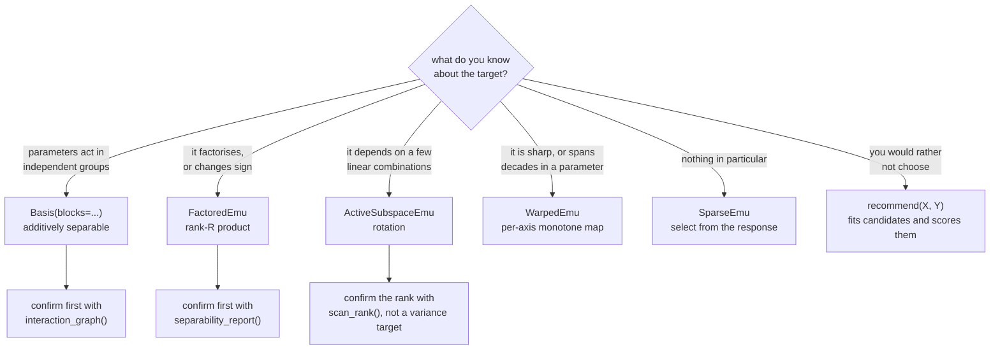

# Making the basis smaller

A fit costs $O(ND^2)$ to accumulate and $O(D^3)$ to solve, and stores a $D
\times m$ coefficient array, so $D$ is the budget. An isotropic basis spends it
as $C(n+d, d)$, which at $n = 7$ reaches 116,280 by degree 14 and at $n = 20, d
= 6$ is 230,230 terms and a 404 GiB moment matrix.

Four levers cut $D$. They are not interchangeable: each states a different
assumption about the target, and each is wrong in a different way when the
assumption does not hold.

Term count against degree at $n = 7$, log scale, every value enumerated by the
package. Read the vertical gaps: at degree 12 the isotropic basis is 50,388
terms, `max_interaction=2` is 1,471, a rank-2 rotation is 91.

## The four levers

| lever | the assumption | what it costs when wrong |
|---|---|---|
| [Prior truncation](basis.md) | you know which terms are absent | a coupling outside the stated index set is unrecoverable |
| [Selection from the response](sparse.md) | the target is sparse in some basis | greedy selection can miss a term it never scored |
| [Product structure](factored.md) | the target factorises over parameter blocks | a non-multiplicative target needs rank, and rank is not free |
| [Better coordinates](coordinates.md) | the structure is there but not in these axes | a projection discards a direction permanently |

The fourth is different in kind. The first three cut the term count at a fixed
convergence rate. A warp moves the rate itself: polynomial convergence goes as
$\rho^{-d}$ with $\rho$ set by the distance from the interval to the nearest
singularity of the target in the complex plane, and a monotone warp is a
conformal map that moves that singularity. Because the term count grows as
$d^{\,n}$, halving the degree divides the basis by $2^{\,n}$, so this multiplies
with whatever the other three achieve rather than overlapping with them.

## Choosing one

The three confirmations are not politeness. An assumption imposed without
checking is the failure mode each lever has: a cross-block coupling is not
recoverable after `blocks` has excluded it, and a rank chosen from a variance
target overshoots, because a direction costs a whole dimension of the $C(d+r,
r)$ growth however little variance it carries.

If none of this is known, [`recommend(X, Y)`](recommend.md) fits candidates and
chooses on held-out error rather than on an assumption.

## What each one bought, measured

| | measured |
|---|---|
| `Basis(blocks=...)` | 230,230 to 1,845 terms at $p=20$, $d=6$ with four blocks of five; the dense moment matrix from 404 GiB to 26 MiB |
| `Basis(parity=...)` and per-parameter caps | 792 to 546 terms with caps alone, to 223 once parity applied, on a 5-parameter degree-7 target |
| `SparseEmu` | 60 of 1,621 candidates beat the isotropic degree-8 basis of 1,287 terms, on a target needing degree 18 in one direction and 2 in another |
| `FactoredEmu` | three blocks at degree 5 reach total degree 15 over nine parameters with 168 coefficients, against $C(24,15) = 1{,}307{,}504$ isotropic terms |
| `ActiveSubspaceEmu` | 91 terms at rank 2, degree 12 for 11.5 percent, against 3,432 isotropic degree-7 terms for 18.4 percent |
| `WarpedEmu` | held-out error from 138.5 to 0.041 percent on a target polynomial in the logs of two decades-spanning parameters |

Numbers from different targets are not comparable with each other; each row says
what that lever did on the target it suits.

## Composing them

They compose, and the order matters. `PreconditionedEmu` fits both orders of
warp and rotation and keeps the one with the lower held-out error, because
neither dominates: a sharp feature along a rotated direction is invisible to a
per-axis warp, while a ridge in warped coordinates is not a ridge in the raw
ones. [Better coordinates](coordinates.md) has the measurements.
