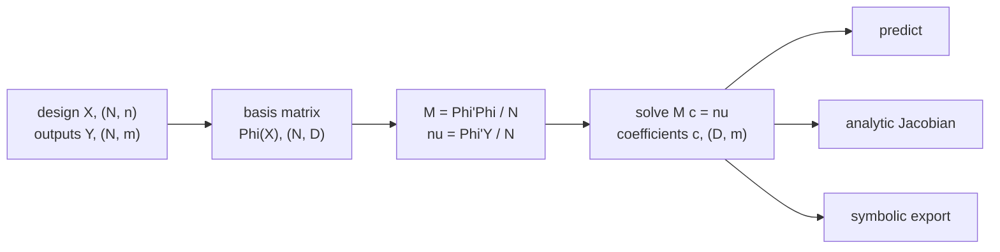

# MomentEmu

A polynomial emulator for smooth maps from parameters to outputs. Training is a
closed-form solve of one linear system built from two moment matrices, not an
iterative optimisation, so a fit has no learning rate, no early stopping and
nothing to restart. The result is a set of polynomial coefficients, which can be
differentiated analytically and exported as a symbolic expression.

Method: Zhang (2025), [arXiv:2507.02179](https://arxiv.org/abs/2507.02179).

## What a fit is



`D` is the number of basis columns, and it is the quantity the rest of this
package exists to control. An isotropic basis of every monomial up to degree
`d` in `n` parameters has `C(n+d, d)` columns:

| n | d | columns |
|---|---|---|
| 3 | 6 | 84 |
| 7 | 6 | 1,716 |
| 7 | 12 | 50,388 |
| 12 | 8 | 125,970 |
| 20 | 6 | 230,230 |

The moment matrix is `D x D`, so at 230,230 columns it is 404 GiB. Four levers
cut `D`, and [Making the basis smaller](guide/reduction.md) is organised around
them.

## Minimal use

```python
from MomentEmu import PolyEmu

emu = PolyEmu(X, Y)                  # X is (N, n), Y is (N, m)
Y_hat = emu.forward_emulator(X_new)
```

The degree is swept upward and stops when the held-out RMSE reaches `RMSE_tol`,
so the call above already chooses one thing for you. [`recommend`](guide/recommend.md)
chooses the rest.

## What it suits

A target that is smooth in its parameters over a bounded box, sampled densely
enough to fill the basis, and evaluated many times afterwards. The fit cost is
paid once; inference is a matrix product.

It does not suit a target with a discontinuity or a kink inside the box, a
design that is not a filled box (the prediction guard warns outside the training
range rather than extrapolating quietly), or a parameter count large enough that
`C(n+d, d)` is unreachable and none of the four levers applies.

## Where to go next

| If you want to | Read |
|---|---|
| fit and predict now | [Quick start](guide/quickstart.md) |
| know what is being solved | [Moment projection](guide/method.md) |
| understand the conditioning warnings | [Accuracy and conditioning](guide/numerics.md) |
| make the basis smaller | [Making the basis smaller](guide/reduction.md) |
| read structure out of a fitted model | [Diagnostics](guide/diagnostics.md) |
| save, cite, or export to SymPy/JAX/PyTorch | [Deployment](guide/persistence.md) |
